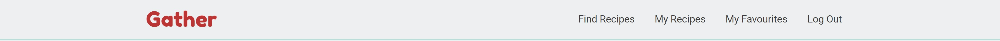

# Gather Online Recipe Journal

## Milestone Project 3 - Backend Development

<h2 align="center"></h2>

* Gather is a recipe website which allows users to submit their own recipes, as well as view those submitted by other members. There is the option to ‘favourite’ recipes so that the user can quickly and easily find their favourite recipes. The website design is responsive so it can be used on any device.

* This is my Milestone Project 3 submission for Code Institute's Diploma in Web Application Development course. My website uses both relational and non-relational databases, features full CRUD functionality and is built using technologies that I have learnt including HTML, CSS, JavaScript, Python, Flask and PostgreSQL.

## Live Project

[View the live project here.](https://https://gather-recipe-website.herokuapp.com/)

## Repository

[View the live project here.](https://github.com/Isabella-Mitchell/gather-recipe-website)

# Table of Contents

To Complete

# User Experience

## User stoires

### First-time Users

* As a first-time user, I want the landing page of the website to explain the purpose of the website and allow me to preview the content.

* As a first-time user, I want to be able to register for an account.

* As a first-time user, I want the website to work on any device.

### Returning Users

* As a returning user, I want to be able to log in to my account.

* As a returning user, I want to be able to create/ view/ edit/ delete my own recipes.

* As a returning user, I want to be able to view other user’s recipes.

* As a returning user, I want to be able to favourite recipes and have a view where I can easily see all my favourite recipes in one place. I also want to be able to unfavourite recipes to remove them from this view.

* As a returning user, I want recipes to include useful information such as a title, ingredient list, instructions broken down into steps, time to make, difficulty level, cuisine, serving size, tags, link to a URL and an image. 

* As a returning user, I want to be able to get a quick overview of a recipe, but also view that recipe on its own page.

* As a returning user, I want to be able to search for recipes, to make it quicker to find recipes with a certain word in their name, tags or ingredient list.

* As a returning user, I want to be able to access and use the website on any device.

### Buisness Owner

* As a business owner, I want users to be able to create, edit and delete their own recipes, but not those of any other user.

* As a business owner, I want the adding, editing and deleting of cuisines to be limited to admin or those with permission. 

* As a business owner, I want it to be as easy as possible for users to submit recipes, e.g. they can copy and paste an ingredients list in.

* As a business owner, I want the website to function and look good on any device.

## Design

### Overview

- The website design is playful, colourful and youthful. The name ‘Gather’ refers to the website’s purpose as a way of ‘gathering’ recipes. It also refers to the way that mealtimes are social, and encourage people to gather together. I looked at the design of cookbooks and kitchen interiors for inspiration. Gather’s aesthetic is simple yet full of character, inviting and easy to use.

### Colour
<h2 align="center"></h2>

- Gather uses a simple colour scheme of white, light grey and dark grey with pops of turquoise and red. The background is light grey, with a top and bottom border in turquoise, distinguishing the top nav bar and the bottom footer sections. I have used cards with a white background for areas of dense text for improved legibility. The logo, social icons and anchor links are in the website’s distinctive ‘gather red’ colour. Buttons are either in dark grey or gather-red.

### Typography

- Headings are in Fredoka One with cursive as a fallback font. As a big, round, bold font, the sparing use of Fredoka One brings a playful touch to the whole website. The body is in Roboto with sans-serif as a fallback font. This means the text will be easy to read on all device sizes.

### Imagery 

- I have not used much imagery on the website, as users can upload their own recipe photos. There is a splash image on the landing page to set the tone of the website. The background is a similar colour to the turquoise of the colour scheme.

### Icons

- I have used icons on buttons on the website to enhance the text that states the button’s action. 

# Wireframes

- [View my wireframes in PDF form here](gather/static/readme/wireframes/gather-wireframe.pdf).

# Features

## All Pages

### Nav Bar

<h2 align="center"></h2>
<h2 align="center"></h2>
<h2 align="center"></h2>

- The nav bar presents different options whether the user is logged in or logged out or an administrator.

- The links change colour on hover, to signal to the user which link they have the mouse over.

- The logo links back to the main landing page.

- The nav bar turns into a slide-out menu on smaller screen sizes

### Footer 

<h2 align="center"></h2>

- The footer includes the website’s name and a brief description. 

- It also features icons with links out to social media. These windows open in a new tab. The icons feature ARIA labels for accessibility best practices.

### Flash Messages

<h2 align="center"></h2>

- Flash messages appear to confirm when a user has completed an action. E.g. they have logged in or out, they have added, edited or deleted a recipe, or they have added or removed a favoruite recipe.

- The styling of the flash messages is inkeeping with the rest of the site. They alert the user but are not too distracting to ensure a good user experience.

## Index (Landing Page)

<h2 align="center"></h2>

<h2 align="center"></h2>

## Register/ Log In Pages

## Find Recipes

## View Recipe

## My Recipes (Dashboard)

## Submit/ Edit Recipe

## Favourite Recipes

## Manage Cuisine

## Add/ Edit Cuisine

## Delete Recipe/ Cuisine

# Future Features

To complete

# Data Model

To complete

# Technologies Used

## Languages Used

- [HTML5](https://en.wikipedia.org/wiki/HTML5)

- [CSS3](https://en.wikipedia.org/wiki/CSS)

- [JavaScript](https://en.wikipedia.org/wiki/JavaScript)

- [Python](https://en.wikipedia.org/wiki/Python_(programming_language))

## Frameworks Libraries and Programs

- Heroku - deplayment and database

- Materialise CSS

- Flask

- MongoDB

- Jinja

- [jQuery](https://jquery.com/)
  - I used jQuery to reduce the amount of code I needed to manipulate the DOM in the game. jQuery is also used by Bootstrap.

- [Google Fonts](https://fonts.google.com/)
  - One font was imported from google fonts. Baskervville for the headings.
  
- [Font awesome](https://fontawesome.com/)
  - I used icons from font awesome to create the round score indicators and social media icons.

- [Git](https://git-scm.com/)
  - Git was used as a version control in the terminal.

- [Github](https://github.com/)
  - Github was used to create and store the project repository.

- [Gitpod](https://gitpod.io/)
  - Gitpod was used to create my files and where I wrote the code.

- [Balsamiq](https://balsamiq.com/)
  - Balsamiq was used to create Wireframes for the project during the initial planning stage.

- [Techsini](https://techsini.com/multi-mockup/)
  - Techsini was used to help check responsiveness and take screenshots of the page at different screen sizes.

- [Adobe Photoshop](https://www.adobe.com/ie/products/photoshop.html)
  - Photoshop was used to resize images for the website.

- [TinyPNG](https://tinypng.com/)
  - TinyPNG was used to compress images for a faster loading time.

- [WebFormatter](https://webformatter.com/html)
  - WebFormatter was used to help beautify the code.

- [Google Chrome Dev Tools](https://developer.chrome.com/docs/devtools/)
  - Google Chrome's Dev Tools were used while building the project to test responsiveness and for debugging.

- [Wave Webaim](https://wave.webaim.org/)

- Schema mock up genorator

# Testing

- Please refer [here](TESTING.md) for more information on testing of the Gather website

# Deployment

## Creating a Gitpod Workspace

The project was created in Gitpod using the Code Institute Gitpod Full Template using these steps:

1. Log in to GitHub and go to the [Code Institute student template for Gitpod](https://github.com/Code-Institute-Org/gitpod-full-template)
2. Click 'Use this Template' next to the Green Gitpod button.
3. Add a repository name and click 'Create reposiory from template'.
4. This will create a copy of the template in your own repository. Now you can click the green 'Gitpod' button to open a workspace in Gitpod.

## Heroku

To complete

## Forking the GitHub Repository

Forks are used to propose changes to someone else's project or to use someone else's project as a starting point for your own idea. By forking the GitHub Repository you make a copy of the original repository on our GitHub account to view and/or make changes without affecting the original repository.

To Fork a Github Repository:

1. Log in to GitHub and go to the [GitHub Repository](https://github.com/Isabella-Mitchell/gather-recipe-website)
2. Locate the Fork button in the top-right corner of the page, click Fork.
3. You should now have a copy of the original repository in your GitHub account.

## Making a Local Clone

You will now have a fork of the repository, but you don't have the files in that repository locally on your computer.

To make a local clone:

1. Log in to GitHub and go to the [GitHub Repository](https://github.com/Isabella-Mitchell/gather-recipe-website)
2. Above the list of files, click  Code.
3. To clone the repository using HTTPS, under "Clone with HTTPS", click the 'Copy' icon. To clone the repository using an SSH key, including a certificate issued by your organization's SSH certificate authority, click Use SSH, then click the 'Copy' icon. To clone a repository using GitHub CLI, click Use GitHub CLI, then click the 'Copy' icon.
4. Open Git Bash.
5. Change the current working directory to the location where you want the cloned directory.
6. Type git clone, and then paste the URL you copied earlier. It will look like this, with your GitHub AE username instead of YOUR-USERNAME:

```
$ git clone https://github.com/YOUR-USERNAME/YOUR-REPOSITORY
```

7. Press Enter. Your local clone will be created.

```
$ git clone https://github.com/YOUR-USERNAME/YOUR-REPOSITORY
> Cloning into `gather-recipe-website`...
> remote: Counting objects: 10, done.
> remote: Compressing objects: 100% (8/8), done.
> remove: Total 10 (delta 1), reused 10 (delta 1)
> Unpacking objects: 100% (10/10), done.
```

Click [Here](https://docs.github.com/en/github-ae@latest/get-started/quickstart/fork-a-repo) for the GitHub quick start guide with images and more detailed explanations of the above process.

# Credits

To complete

## Code

## Content

## Media