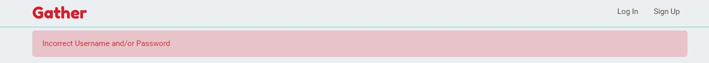
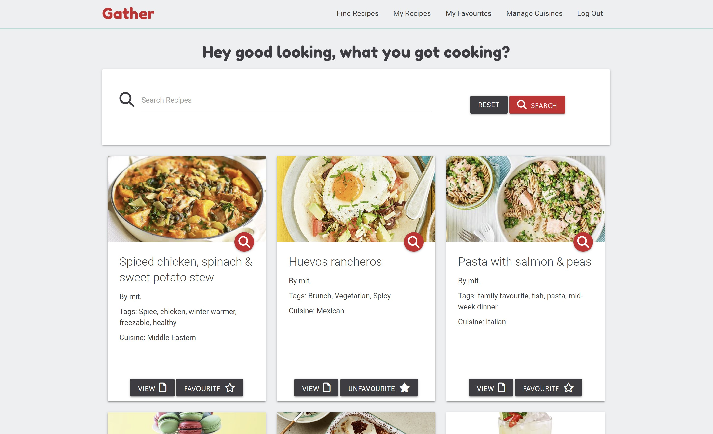
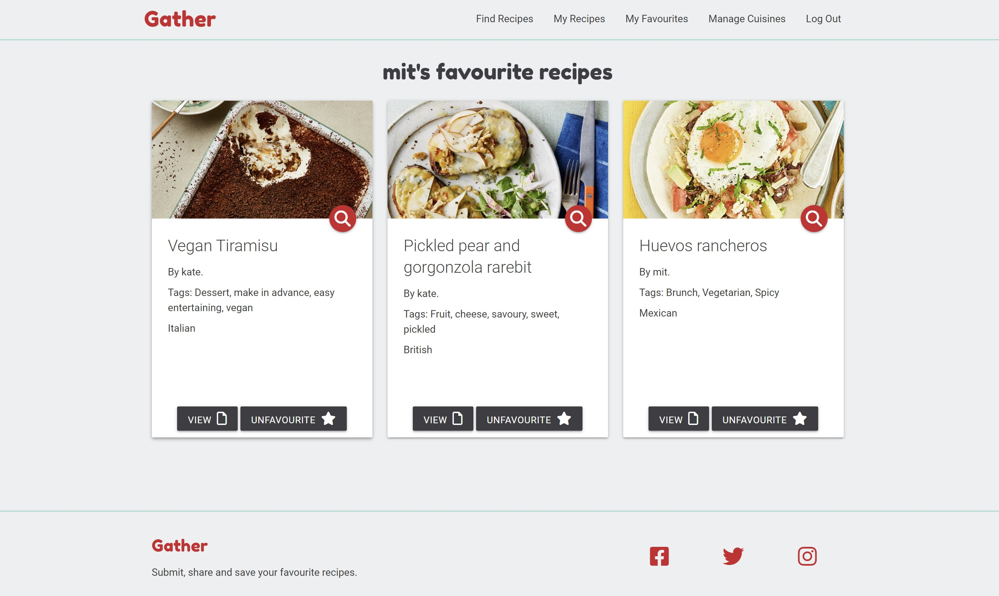
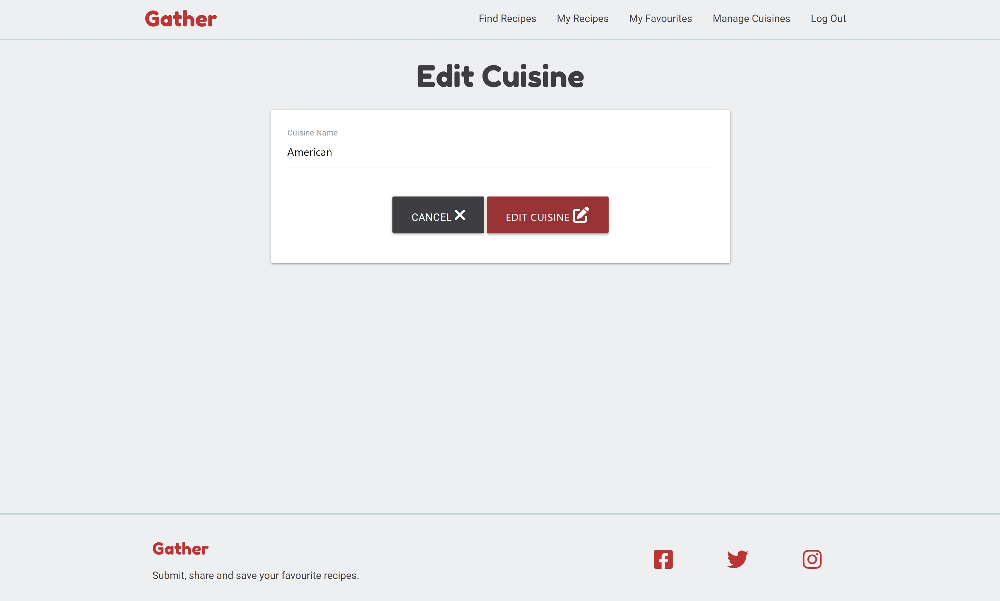
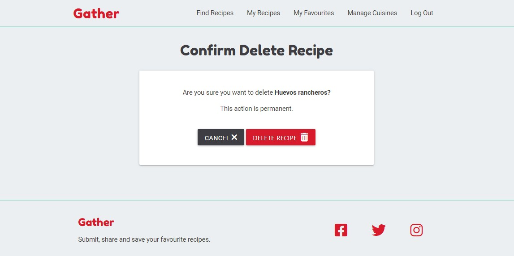
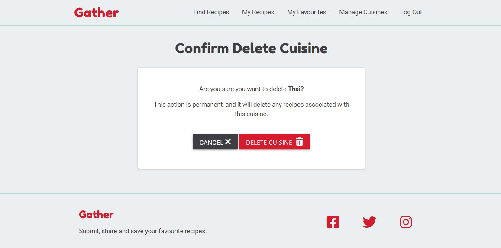

# Gather Online Recipe Journal

## Milestone Project 3 - Backend Development

<h2 align="center"></h2>

* Gather is a recipe website which allows users to submit their own recipes, as well as view those submitted by other members. There is the option to ‘favourite’ recipes so that the user can quickly and easily find their favourite recipes. The website design is responsive so it can be used on any device.

* This is my Milestone Project 3 submission for Code Institute's Diploma in Web Application Development course. My website uses both relational and non-relational databases, features full CRUD functionality and is built using technologies that I have learnt including HTML, CSS, JavaScript, Python, Flask and PostgreSQL.

## Live Project

[View the live project here.](https://https://gather-recipe-website.herokuapp.com/)

## Repository

[View the live project here.](https://github.com/Isabella-Mitchell/gather-recipe-website)

# Table of Contents

## Contents
- [User experience](#user-experience)
  * [User Stories](#user-stories)
    + [First-time Users](#first-time-users)
    + [Returning Users](#returning-users)
    + [Business Owner](#business-owner)
- [Design](#design)
  + [Overview](#overview)
  + [Colour Scheme](#colour-scheme)
  + [Typography](#typography)
  + [Imagery and Aesthetics](#imagery-and-aesthetics)
  + [Icons](#icons)
  + [Cards](#cards)
- [Wireframes](#wireframes)
- [Features](#features)
  + [All Pages Features](#all-pages-features)
  + [Index (Landing Page) Features](#index-landing-page-features)

  
  + [Game Page Features](#game-page-features)
  + [Sightings Page Features](#sightings-page-features)
  + [Future Features](#future-features)
- [Technologies used](#technologies-used)
  + [Languages Used](#languages-used)
  + [Frameworks Libraries and Programs](#frameworks-libraries-and-programs)
  + [Application Programming Interface (API's)](#application-programming-interface-apis)
- [Testing](#testing)
- [Deployment](#deployment)
  + [Creating a Gitpod Workspace](#creating-a-gitpod-workspace)
  + [GitHub Pages](#github-pages)
  + [Forking the GitHub Repository](#forking-the-github-repository)
  + [Making a Local Clone](#making-a-local-clone)
- [Credits](#credits)
  + [Code](#code)
  + [Media](#media)
  + [Content](#content)
  + [Acknowledgements](#acknowledgements)

# User Experience

## User stoires

### First-time Users

* As a first-time user, I want the landing page of the website to explain the purpose of the website and allow me to preview the content.

* As a first-time user, I want to be able to register for an account.

* As a first-time user, I want the website to work on any device.

### Returning Users

* As a returning user, I want to be able to log in to my account.

* As a returning user, I want to be able to create/ view/ edit/ delete my own recipes.

* As a returning user, I want to be able to view other user’s recipes.

* As a returning user, I want to be able to favourite recipes and have a view where I can easily see all my favourite recipes in one place. I also want to be able to unfavourite recipes to remove them from this view.

* As a returning user, I want recipes to include useful information such as a title, ingredient list, instructions broken down into steps, time to make, difficulty level, cuisine, serving size, tags, link to a URL and an image. 

* As a returning user, I want to be able to get a quick overview of a recipe, but also view that recipe on its own page.

* As a returning user, I want to be able to search for recipes, to make it quicker to find recipes with a certain word in their name, tags or ingredient list.

* As a returning user, I want to be able to access and use the website on any device.

### Buisness Owner

* As a business owner, I want users to be able to create, edit and delete their own recipes, but not those of any other user.

* As a business owner, I want the adding, editing and deleting of cuisines to be limited to admin or those with permission. 

* As a business owner, I want it to be as easy as possible for users to submit recipes, e.g. they can copy and paste an ingredients list in.

* As a business owner, I want the website to function and look good on any device.

## Design

### Overview

- The website design is playful, colourful and youthful. The name ‘Gather’ refers to the website’s purpose as a way of ‘gathering’ recipes. It also refers to the way that mealtimes are social, and encourage people to gather together. I looked at the design of cookbooks and kitchen interiors for inspiration. Gather’s aesthetic is simple yet full of character, inviting and easy to use.

### Colour
<h2 align="center"></h2>

- Gather uses a simple colour scheme of white, light grey and dark grey with pops of turquoise and red. The background is light grey, with a top and bottom border in turquoise, distinguishing the top nav bar and the bottom footer sections. I have used cards with a white background for areas of dense text for improved legibility. The logo, social icons and anchor links are in the website’s distinctive ‘gather red’ colour. Buttons are either in dark grey or gather-red.

### Typography

- Headings are in Fredoka One with cursive as a fallback font. As a big, round, bold font, the sparing use of Fredoka One brings a playful touch to the whole website. The body is in Roboto with sans-serif as a fallback font. This means the text will be easy to read on all device sizes.

### Imagery 

- I have not used much imagery on the website, as users can upload their own recipe photos. There is a splash image on the landing page to set the tone of the website. The background is a similar colour to the turquoise of the colour scheme.

### Icons

- I have used icons on buttons on the website to enhance the text that states the button’s action. 

### Cards

- I have used Materialize CSS card componants for displaying recipes and forms. This makes the content stand out from the website background. It also neatly presents the various recipes, brining a sense of harmony and consistency to the website.

# Wireframes

- [View my wireframes in PDF form here](gather/static/readme/wireframes/gather-wireframe.pdf).

# Features

## All Pages Features

### Nav Bar

<h2 align="center"></h2>
<h2 align="center"></h2>
<h2 align="center"></h2>

- The nav bar presents different options whether the user is logged in or logged out or an administrator.

- The links change colour on hover, to signal to the user which link they have the mouse over.

- The logo links back to the main landing page.

- The nav bar turns into a slide-out menu on smaller screen sizes

### Footer 

<h2 align="center"></h2>

- The footer includes the website’s name and a brief description. 

- It also features icons with links out to social media. These windows open in a new tab. The icons feature ARIA labels for accessibility best practices.

### Flash Messages

<h2 align="center"></h2>

- Flash messages appear to confirm when a user has completed an action. E.g. they have logged in or out, they have added, edited or deleted a recipe, or they have added or removed a favourite recipe.

- Flash messages are also used to inform the user when they do not have access to a page. E.g. a non-admin user is trying to access an admin-only page.

- The styling of the flash messages is inkeeping with the rest of the site. They alert the user but are not too distracting to ensure a good user experience.

## Index (Landing Page) Features

<h2 align="center"></h2>

<h2 align="center"></h2>

- The purpose of the Gather website landing page is to explain the purpose of the website. It does this with an eye-catching jumbatron with a tag line and a 'three-across' explainer section with icons. 

- There are big red call-to-action buttons on the page, making the next step clear and easy to the user.

- Once a users are logged in, the buttons on the landing page change. This means that the page is still useful for a returning user, as it directs them to different pages within the website.

### Landing Page Recipe Cards

- Another purpose of the landing page is to give the user a feel of the content they can access if they sign up and register. These are displayed as "featured collections" on the homepage. These include "Recently Added Recipes" and "Quick Recipes". Recently Added Recipes will change often, which will help keen the landing page looking fresh.

<h2 align="center"></h2>

- The user can quick-view and view these recipes (see these features in more detail below) If the user if logged out, the Favourite button is replaced with a Call to action. 

## Register/ Log In Pages

<h2 align="center"></h2>

<h2 align="center"></h2>

- The Register and Log in pages both feature forms, a large red submit button, and a link to the other page incase a user is in the wrong place. E.g. on the Register Page, it says "Already Registered? Log in here."

- The Register form features input fields for Username, First Name, Last Name and Password. All fields are required.

- The Log in form features input fields for Username and Password. All fields are required.

- The User's password is hashed for security.

<h2 align="center"></h2>

- Each Username must be unique, so when a new user registers, their entered username is checked. If it already exists, a flash message informs the user to try another username.

<h2 align="center"></h2>

- If incorrect log in details are provided, then a flash message informs the user that the Username and/or password is incorrect.

## Find Recipes

<h2 align="center"></h2>

- The purpose of this page is to show the users all recipes. This includes their own recipes and those submitted by other users.

- From this page, users can search recipes, quick-view recipes, view recipes, and favourite recipes.

- The user's own recipes appear in the same way as peer submitted recipes. I chose to do this to keep the format neat. User's can manage their own recipes from their 'My Recipe' page.

### Search Recipes

- The search feature uses a Mongo DB's index. This returns search results based on the recipe name, recipe tags and ingrediant list.

<h2 align="center"></h2>

- If no results are found, then a message appears to inform the user.

## Quick View Recipe

<h2 align="center"></h2>

- The quick-view expands the information on the card, that the user can scroll through without navigating away from the page. 

- The quick-view is accessed by pressing the red button with a magnifying glass icon. There is a tooltip that appears when the button is hovered over and an Aria Label for screenreaders. 

- I included this feature to help keep the recipe cards neat and consistent. The intital information that the user can see is the recipe image (if provided), a title, the author, tags, and the cuisine.

- If the user wants to learn something else about a recipe, e.g. how long it takes, or how many servings it makes, then they can use quick view to access this information.

- Then, if a user wants to open a recipe to follow along or print out, they can use the View Recipe option.

## View Recipe

<h2 align="center"></h2>

- The View Recipe page presents the Recipe in a clear and easy to read or follow format.

- Ingrediants are shown in an unordered list.

- Steps are shown in an ordered list.

- There is a back button at the bottom of the page which saves the user neaeing to use their browser back button.

## My Recipes (Dashboard)

<h2 align="center"></h2>

- The My Recipes page is where the user can submit, view and manage their own recipes. 

- While building the project I was calling it the Dashboard and I have used this term in the code, so this is why I describe it as both My Recipes and Dashboard.

- As with other pages, I have used icons, tooltips and Aria labels on buttons, so that it's clear to a user what the buttons do.

<h2 align="center"></h2>

<h2 align="center"></h2>

- This page is only shows recipes submitted by that user. If a user tries to edit or delete recipes that they are not the author of, they will see a flash message informing them and be redirected to the find recipes page.

<h2 align="center"></h2>

- If the user has no recipes, then a message appears to inform the user.

## Submit/ Edit Recipe

<h2 align="center"></h2>

<h2 align="center"></h2>

- The submit and edit recipe pages both feature forms and red submit buttons. The edit page also features a cancel button which directs the user back to to their My Recipes page.

- Input fields include
  - Recipe name (required - text - max 50 characters)
  - Cuisine (selected from dropdown - required)
  - Ingrediant list (required - text - comma seperated)
  - Instructions (required - text - new line seperated)
  - Difficulty (selected from dropdown - required)
  - Duration in minutes (number - required)
  - Serves (number - required)
  - Image URL (text)
  - Tags (required - text - max 50 character - comma seperated)
  - URL (text)

- All inputs are validated and feature labels

- When a user goes to edit a recipe, the content appears in the relevant input fields.

- If a recipe image URL is not provided, then a defualt colour swatch is used.

### Recipe form considerations

- It was difficult to get the right balance between making it easy for users to submit recipes, and making sure the recipes were well presented on the website.

- I decided that I wanted to store the Ingrediants List, Instructions and Tags as arrays in Mongo DB.

- I decided the best way to do this was to make the user enter the Ingrediants List and Tags as comma seperated lists, and the Instructions and a new line seperated list.

- This is because, while developing the site, I found it most convieant to copy and paste recipes in from other websites. That's why I decided to create single text-area inputs for the ingrediants list and instructions list, as opposed to making the user enter each item individually. 

- This solution is not ideal, as it leaves a lot of trust in the user to correctly input recipes, so that they are clear and legible to other users. I have increased speed and ease, at the cost of making the system fool-proof.

- As the ingrediants list input is a text area, I have removed the ability to enter a new line, to encourage the user to use commas.

- However, the user can still copy and paste text in as seperate lines into the ingrediants field instead of using commas. This feature was useful for development, however I have not made this apparent to the user so to the keep the form clear and simple. So I would consider removing this feature in a real-world application.

## Favourite Recipes

<h2 align="center"></h2>

- This feature allows the user to add recipes to their My Favourites page. This would be useful if their is another user's recipe that they like, and would like to "bookmark" it so they can find it easily, and save them having to look through the Find Recipes page.

- Users can also favourite their own recipe if they choose.

- User's can favourite recipes simply by clicking the 'Favourite Recipe' button. Once a recipe is favourited, this is replaced by an 'Unfavourite recipe' button. Clicking this will remove the recipe from the User's favourites.

<h2 align="center"></h2>

- If the user has no favourite recipes, then a message appears to inform the user.

## Manage Cuisines

<h2 align="center"></h2>

- This page lists all the available cuisines in alphabetical order. It gives the admin user the option to add, edit or delete cuisines.

<h2 align="center"></h2>

- This page is only visible to admin users. If a non-admin is logged in and tries to access this page or tries to access the submit, edit or delete a cuisine pages, they will see a flash message informing them and be redirected to the find recipes page.

## Add/ Edit Cuisines

<h2 align="center"></h2>

<h2 align="center"></h2>

- The add and edit cuisine pages feature a form with a single input field for Cuisine Name and a red submit button. The edit button also features a cancel button.

<h2 align="center"></h2>

- Each cuisine name must be unique, and is checked before commiting to the database. If the user enters an exsisting cuisine name, a flash message appears informing them.

- Like the Manage Cuisines page, a flash message appears if a non-admin user tries to access this page.

## Delete Recipe/ Cuisines

<h2 align="center"></h2>

<h2 align="center"></h2>

- If a user clicks on a 'Delete Recipe' or 'Delete Cuisine', they will be taken to this page to confirm the deletion. This is extra step to stop users accidentally deleting things.

- Cuisines are set up with a cascade delete effect. So any recipes with that cuisine will also be deleted. This is made clear on the delete cuisine page.

- There is a cancel button on each page.

## Error Handling

- If there is an error, e.g. the recipe id in the page URL is changed, then the user will be redirected back to the Find Recipes page. Logged-out-users will be directed to the log in page, as they cannot access the Find Recipes page.

- If the user's session cookie deleted, then they will be logged out and unable to access logged-in features.

# Future Features

## User Experience Features 

### Filter by cuisine

- The search functionality does not search by cuisine name as these are not stored in Mongo DB. I would also like to add a filter to the Find Recipes page that filters by cuisine name.

### More “Featured Collections”

- I feel the index page would be improved by having more featured collections such as Most Favourited or Fewest Ingrediants.

### Confirm delete modal rather than a page

- I feel a modal would be better here. I made a page for ease.

### Further improvements to submit/ edit recipe forms

- As explained in the Features section, I feel there is more I could do to improve the UX of inputting a recipe. For example, there could be a format button which would correctly format the user's input. Or a live preview so that the user can see how their input will look on the site.

### Make a confirm password input 

- This would help the user ensure they haven't made a typo in their desired password.

### Add edit/ delete user account functionality

- This would allow the user to edit their username or password, or delete their account.

## Development Features

### Make recipe card snippet to reduce code repition

- As I have used the same Recipe Card format within multiple templates, I could refactor this code and use a "snippet" to reduce the number of times this code is repeated.

### More detailed Try Except exception clauses

- I would like to add more detailed exception clauses to my Try Except statements. I have used a catch-all clause for simplicty.

# Data Model

- [View my Database structure in PDF form here](gather/static/readme/databases/gather-database-schema.pdf).

# Technologies Used

## Languages Used

- [HTML5](https://en.wikipedia.org/wiki/HTML5)

- [CSS3](https://en.wikipedia.org/wiki/CSS)

- [JavaScript](https://en.wikipedia.org/wiki/JavaScript)

- [Python](https://en.wikipedia.org/wiki/Python_(programming_language))

## Frameworks Libraries and Programs

- [Heroku](https://id.heroku.com/login)
  - Heroku is the deployment source I used for this project. I'm also using it for the Postgres relational database

- [MongoDB](https://www.mongodb.com/)
    - I'm using MongoDB for my non-relational database.

- [Flask](https://flask.palletsprojects.com/en/2.2.x/templating/)
  - Templating language I've used with Python to add logic to my html templates.

- [Jinja](https://jinja.palletsprojects.com/en/3.0.x/)
  - Templating language I've used with Python to add logic to my html templates.

- [Materialize CSS](https://materializecss.com/)
  - Front-end library with HTML, CSS and Javascript based componants. I used features including Nav bar, Cards, Buttons and Forms.

- [jQuery](https://jquery.com/)
  - I used jQuery to add functionality to MaterialiseCSS componants.

- [Google Fonts](https://fonts.google.com/)
  - Two fonts are imported from google fonts.
  
- [Font awesome](https://fontawesome.com/)
  - I used icons from font awesome on buttons.

- [Git](https://git-scm.com/)
  - Git was used as a version control in the terminal.

- [Github](https://github.com/)
  - Github was used to create and store the project repository.

- [Gitpod](https://gitpod.io/)
  - Gitpod was used to create my files and where I wrote the code.

- [Balsamiq](https://balsamiq.com/)
  - Balsamiq was used to create Wireframes for the project during the initial planning stage.

- [Techsini](https://techsini.com/multi-mockup/)
  - Techsini was used to help check responsiveness and take screenshots of the page at different screen sizes.

- [Adobe Photoshop](https://www.adobe.com/ie/products/photoshop.html)
  - Photoshop was used to resize images for the website.

- [TinyPNG](https://tinypng.com/)
  - TinyPNG was used to compress images for a faster loading time.

- [WebFormatter](https://webformatter.com/html)
  - WebFormatter was used to help beautify the code.

- [Google Chrome Dev Tools](https://developer.chrome.com/docs/devtools/)
  - Google Chrome's Dev Tools were used while building the project to test responsiveness and for debugging.

- [dbdiagram](https://dbdiagram.io/)
  - Tool used to mock up database structure diagram.

- [Unsplash](https://unsplash.com/)
  - Unsplash was used to source the jumbatron imager.

# Testing

- Please refer [here](TESTING.md) for more information on testing of the Gather website

# Deployment

## Creating a Gitpod Workspace

The project was created in Gitpod using the Code Institute Gitpod Full Template using these steps:

1. Log in to GitHub and go to the [Code Institute student template for Gitpod](https://github.com/Code-Institute-Org/gitpod-full-template)
2. Click 'Use this Template' next to the Green Gitpod button.
3. Add a repository name and click 'Create reposiory from template'.
4. This will create a copy of the template in your own repository. Now you can click the green 'Gitpod' button to open a workspace in Gitpod.

## Forking the GitHub Repository

Forks are used to propose changes to someone else's project or to use someone else's project as a starting point for your own idea. By forking the GitHub Repository you make a copy of the original repository on our GitHub account to view and/or make changes without affecting the original repository.

To Fork a Github Repository:

1. Log in to GitHub and go to the [GitHub Repository](https://github.com/Isabella-Mitchell/gather-recipe-website)
2. Locate the Fork button in the top-right corner of the page, click Fork.
3. You should now have a copy of the original repository in your GitHub account.

## Making a Local Clone

You will now have a fork of the repository, but you don't have the files in that repository locally on your computer.

To make a local clone:

1. Log in to GitHub and go to the [GitHub Repository](https://github.com/Isabella-Mitchell/gather-recipe-website)
2. Above the list of files, click  Code.
3. To clone the repository using HTTPS, under "Clone with HTTPS", click the 'Copy' icon. To clone the repository using an SSH key, including a certificate issued by your organization's SSH certificate authority, click Use SSH, then click the 'Copy' icon. To clone a repository using GitHub CLI, click Use GitHub CLI, then click the 'Copy' icon.
4. Open Git Bash.
5. Change the current working directory to the location where you want the cloned directory.
6. Type git clone, and then paste the URL you copied earlier. It will look like this, with your GitHub AE username instead of YOUR-USERNAME:

```
$ git clone https://github.com/YOUR-USERNAME/YOUR-REPOSITORY
```

7. Press Enter. Your local clone will be created.

```
$ git clone https://github.com/YOUR-USERNAME/YOUR-REPOSITORY
> Cloning into `gather-recipe-website`...
> remote: Counting objects: 10, done.
> remote: Compressing objects: 100% (8/8), done.
> remove: Total 10 (delta 1), reused 10 (delta 1)
> Unpacking objects: 100% (10/10), done.
```

Click [Here](https://docs.github.com/en/github-ae@latest/get-started/quickstart/fork-a-repo) for the GitHub quick start guide with images and more detailed explanations of the above process.

## Creating an application with Heroku

You will need to deploy the application using Heroku.

1. Create a requirements.txt file by typing ``` pip3 freeze --local > requirements.txt ``` into the Gitpod CLI. Ensure this is added to your .gitignore file.
2. Create a Procfile by typing ```echo web: python app.py > Procfile```. Open it and ensure it doesn't have a new line, as this can create errors. Ensure it starts with a capital P.
3. Add and commit these files to Github.
4. Go to [Heroku](https://dashboard.heroku.com/apps). Log in or create an account
5. Click the 'New' button and click 'Create new app'.
6. Enter a unique name for your project with no capital letters or spaces and select your region. Click 'Create App'.
7. Inside your project, go to the Resources tab and create a Heroku Postgres Database
8. Inside your project, go to the 'Settings' tab. Scroll down and click 'Reveal Config Vars'.
9. Add in the following variables
  - IP : 0.0.0.0
  - PORT : 5000
  - MONGO_DBNAME : Your MongoDB database name
  - MONGO_URI : This can be found on MongoDB by going to Clusters, Connect, Connect to your application
  - SECRET_KEY : Your secret key
10. Deploy your project by going to the Deploy tab and choose 'Connect to Github'
11. Find your repository name and select Connect.
12. To connect your Heroku database, go to 'More' in the top right and select run console. Enter ```python3``` to access the python intepreter.
13. Then type ```From gather import db```. Then type ```db.create_all()```. You can then exit the console.

# Credits

## Code

- Materalize CSS: I used this library throughout the project. Particularly for the nav bar, cards, forms and buttons.

- Code Institute: I referred to lessons and source code from Code Institute's Web Application Development course. I sourced the User Authentification and Search bar functionality from the Task Manager Walk Through Project.

## Content

- [BBC Good Food](https://www.bbcgoodfood.com/): I used this exisiting recipe platform to help me plan the user experience and features of the website. I also sourced many recipes from this website.

## Media

- Credit for the Jumbatron image goes to [Ella Olsson](https://unsplash.com/@ellaolsson) sourced from Unsplash.

## Acknowledgements

- Thank you to my Mentor Akshat Garg for helpful feedback, industry insights and recommended tools.

- Thank you to fellow Code Institute students/ alumni for participating in the peer code review. Thank you to my family for manually testing the website and for feedback.

- Thank you to the Code Institute London Community for their encouragement and technical support.

- Thank you to the tutors and staff at Code Institute for their support.

Please note this is a personal project. This website is purely for the sake of the developer's portfolio and not for public consumption.

Isabella Mitchell, 2022.