# Testing

The Gather recipe website has been tested using the following methods:
- [Code Validation](#code-validation)
    - [W3C HTML Validator](#w3c-html-validator) 
    - [W3C CSS Validator](#w3c-css-validator)
    - [JSHINT Javascript Code Quality Tool](#jshint-javascript-code-quality-tool)
    - [Python Validation using Gitpod](python-validation-using-gitpod)
- [A11y Color Contrast Accessibility Checker](#a11y-color-contrast-accessibility-checker)
- [Wave Webaim Accessibility Checker](#wave-webaim-accessibility-checker)
- [Lighthouse](#lighthouse)
- [Responsiveness](#responsiveness)
- [Browser Compatibility](#browser-compatibility)
- [Testing User Stories](#testing-user-stories)
    - [First Time User](#first-time-user)
    - [Returning User](#returning-user)
    - [Business Owner](#business-owner)
- [Manual Testing](#manual-testing)
- [Automated Testing](#automated-testing)
- [Peer Review](#peer-review)
- [Bugs](#bugs)
    - [Resolved](#resolved)
    - [Unresolved](#unresolved)

# Code Validation

## W3C HTML Validator

<h2 align="center">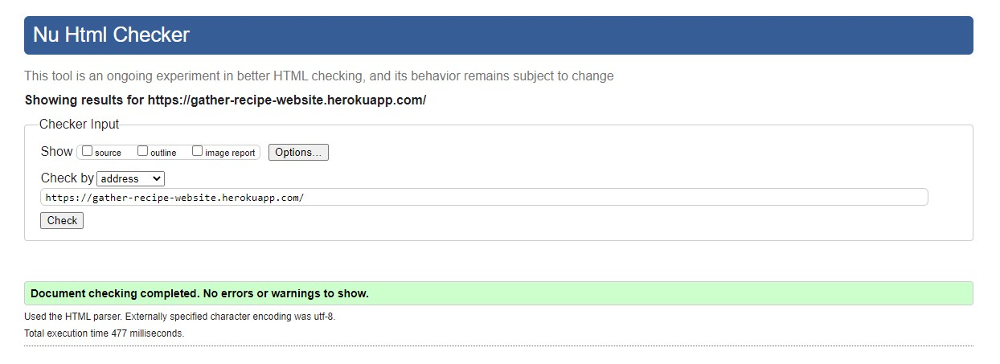</h2>

- The Gather website landing page passed all tests using the [W3C HTML](https://validator.w3.org/) Validator tool

<h2 align="center">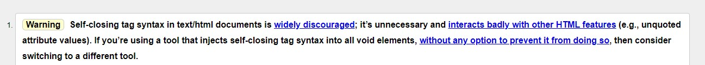</h2>

- The Gather website log in page showed some errors as the form fields have self closing tags. This is something I will look into avoiding in future projects.

## W3C CSS Validator

<h2 align="center">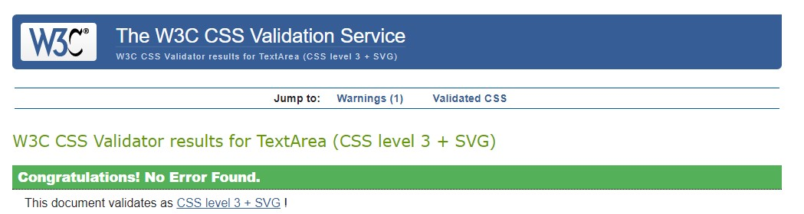</h2>

- The Gather website passed all tests using the [W3C CSS](https://jigsaw.w3.org/css-validator/) Validator tool

## JSHINT Javascript Code Quality Tool

<h2 align="center">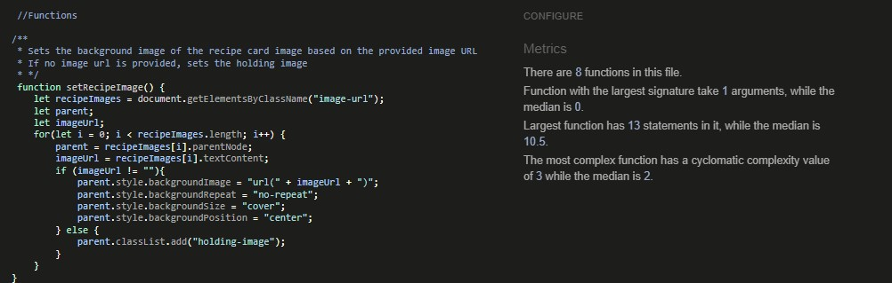</h2>
<h2 align="center">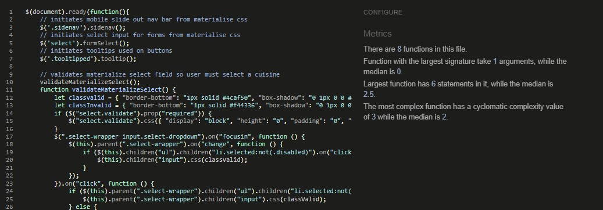</h2>

- The Gather website passed all tests using the [JSHint](https://jshint.com/) Validator tool

## Python Validation using Gitpod

<h2 align="center">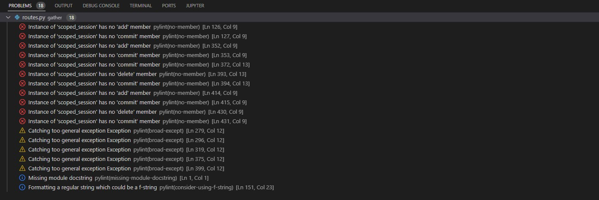</h2>

- Errors and warnings highlighted by Gitpod included:
    - Scope_session errors. From looking online, this is not actually an error. I could add code to stop this showing as an error
    - Too general exceptions. See future features.

# A11y Color Contrast Accessibility Checker

<h2 align="center">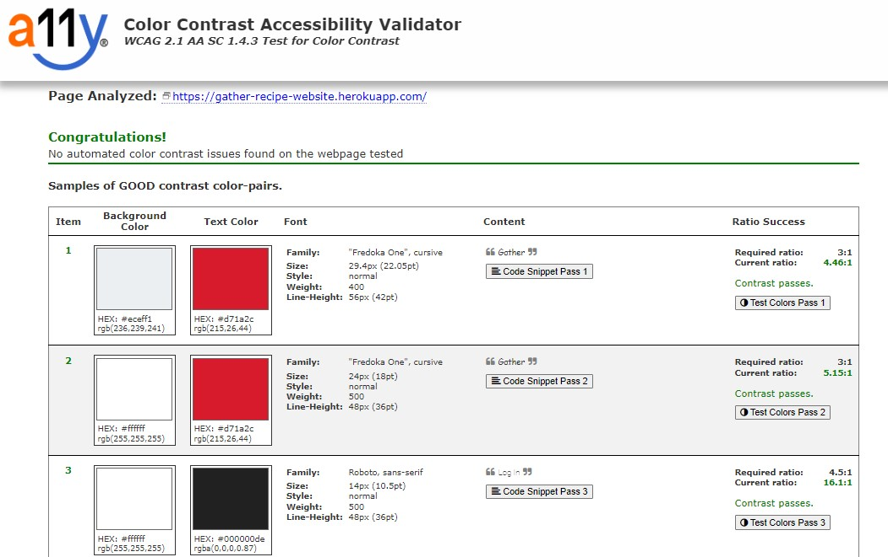</h2>

- The index page was tested using the [A11y Color Contrast Accessibility Checker](https://color.a11y.com/) and no colour contrast issues were found. The same colour palette is used across the site.

# Wave Webaim Accessibility Checker

<h2 align="center">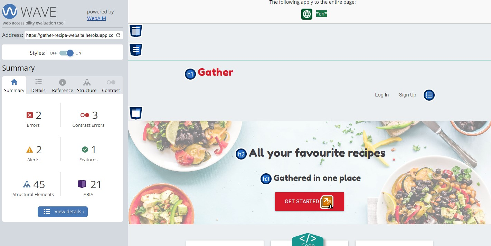</h2>

- The index page was tested using the [Wave Webaim](https://wave.webaim.org/) accessibility checker and no serious issues were found. 
- The Errors found refer to the fake URLs I've entered for recipe placeholders. The Colour contrast error refers to hidden labels for the Social Media icons.

# Lighthouse

I used the Lighthouse reports in Google Developer Tools to examine the pages of the website for the following
- Performace
- Accessibility
- Best Practices 
- SEO

<h2 align="center">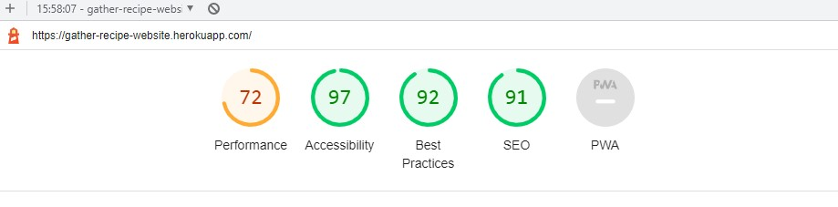</h2>

- Gather website scored well in all areas on mobile except for performance. This could be improved by saving images in next gen formats and eliminating unused Javascript. The JS scripts are present on the base template and used by other pages.

<h2 align="center">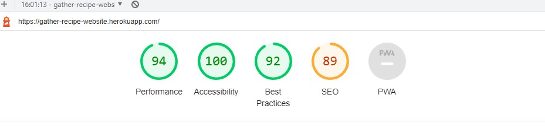</h2>

- Gather website scored well in all areas on desktop. The Quick View functionality, which uses anchor links without a href caused the SEO score to be lower than desired. 

# Browser Compatibility

The site was tested in Google Chrome, Microsoft Edge and Mozilla Firefox on desktop.

The site was tested in Google Chrome and Safari on mobile and tablet.

No issues arose during browser testing.

# Responsiveness

Responsivity tests were carried out using Google Chrome DevTools. Device screen sizes covered include:
- iPhone SE
- iPhone XR
- iPhone 12 Pro
- Pixel 5
- Samsung Galaxy S8+
- Samsung Galaxy S20 Ultra
- iPad Mini
- iPad Air
- Surface Pro 7
- Surface Duo
- Galaxy Fold
- Samsung Galaxy A51/71
- Nest Hub
- Nest Hub Max

I also personally tested the website on iPhone 11, iPad Pro 2nd Generation, Dell XPS 15 laptop and a Dell widescreen monitor.

# Testing User Stories

### First-time Users

- As a first-time user, I want the landing page of the website to explain the purpose of the website and allow me to preview the content.

    - The landing page of the website features an eye-catching jumbatron with an image and tag line which gives a feel and overview of the website. There is also a 'Three-across' section which explains the features in more detail.
    - There are some featured recipes so the user can preview content without logging in.
    - The website footer also features the website's name and a description of its purpose.

<h2 align="center"></h2>

* As a first-time user, I want to be able to register for an account.
     - There is a sign up page. These can be accessed from the nav bar and also from Call-to-action buttons on the landing page.
     - There is also a link on the log in page.

<h2 align="center"></h2>

* As a first-time user, I want the website to work on any device.

    - The website is responses and works on any device size.

### Returning Users

* As a returning user, I want to be able to log in to my account.
    - There is a log in page. This can accessed from the nav bar. There is also a link at the bottom of the sign up page.

<h2 align="center"></h2>

* As a returning user, I want to be able to create/ view/ edit/ delete my own recipes.
    - Logged in users have a My Recipes page where they can manage their recipes
    - Users can create recipes via the Submit Recipe button
    - Users can edit their own recipes via the Edit Recipe button
    - Users can delete their own recipes via the Delete Recipe button
    - Users can view their own recipes via the View Recipe button
    - Users can only edit and delete their own recipes.

<h2 align="center"></h2>

* As a returning user, I want to be able to view other user’s recipes.
    - Logged in users can access the Find Recipes page, which shows all user's recipes.
    - Users can quick view or view any other users' recipes.

<h2 align="center"></h2>

* As a returning user, I want to be able to favourite recipes and have a view where I can easily see all my favourite recipes in one place. I also want to be able to unfavourite recipes to remove them from this view.
    - Logged in users can use the Favourite Recipe feature.
    - If a user 'favourites' a recipe, it will appear in their My Favourites page.
    - If a user 'unfavourites' a recipe, it will be removed from their My Favourites page

<h2 align="center"></h2>

* As a returning user, I want recipes to include useful information such as a title, ingredient list, instructions broken down into steps, time to make, difficulty level, cuisine, serving size, tags, link to a URL and an image. 
    - These features are included in the Quick View and View Recipe views.
    - If no image URL is provided, then a default image is used.

* As a returning user, I want to be able to get a quick overview of a recipe, but also view that recipe on its own page.
    - The user can use the Quick-View feature to quickly see more about a recipe.
    - The user can choose to View the Recipe to get the recipe presently clearly on its own page.

<h2 align="center"></h2>
<h2 align="center"></h2>

* As a returning user, I want to be able to search for recipes, to make it quicker to find recipes with a certain word in their name, tags or ingredient list.
    - The user can use the search function on the Find Recipes page.

* As a returning user, I want to be able to access and use the website on any device.
    - The website is functional on any screen size.

### Buisness Owner

* As a business owner, I want only logged in users to be able to submit and favoruite recipes. I want user to only be able to edit and delete their own recipes, but not those of any other user.
    - There are permissions in place, so users must be logged in to access certain pages, and users can only edit and delete their own recipes.

* As a business owner, I want the adding, editing and deleting of cuisines to be limited to admin or those with permission. 
    - There are permissions in place, so users must be admins to access manage cuisine pages, and admins can only edit and delete cuisines.

* As a business owner, I want it to be as easy as possible for users to submit recipes, e.g. they can copy and paste an ingredients list in.
    - There are text-area inputs so that users can copy and paste recipes in.

* As a business owner, I want the website to function and look good on any device.
    - The website functions and looks good on any device size.

# Manual Testing

## Nav Bar

<h2 align="center"></h2>

* The main navigation buttons have been tested and proven to work
* User permissions have been tested and proven to work

## Footer

<h2 align="center">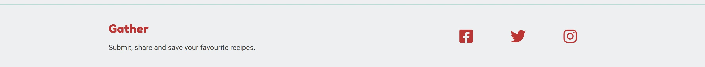</h2>

* Social links in the footer have been tested and proven to work

## Flash Messages

<h2 align="center">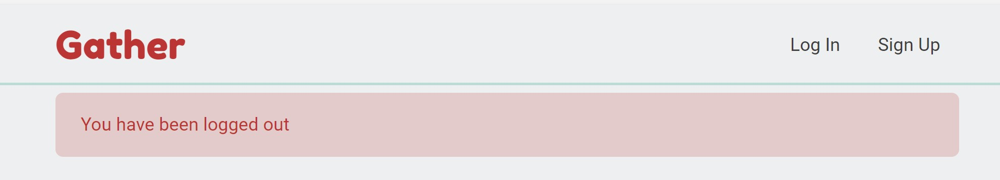</h2>

* Flash messages show and disappear as desired

## Index Page

<h2 align="center"></h2>

* Buttons have been tested and proven to work
* User permissions showing the correct buttons have been tested and proven to work

## Register/ Log In Pages

<h2 align="center"></h2>
<h2 align="center">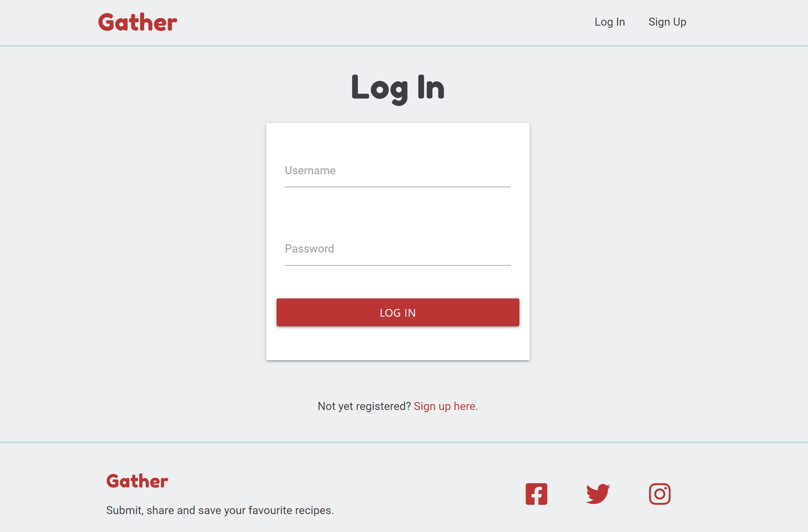</h2>

* Buttons, forms and links have been tested and proven to work
* I've tested using a non-unique username. I was not able to and a flash message appeared
* I've tested logging in with incorrect details. I was not able to. I was redirected and flash message appeared informing me I did not have permission.

## Find Recipes

<h2 align="center"></h2>

* Buttons have been tested and proven to work.
* I've tested trying to access this page as a logged out user. I was not able to. I was redirected and flash message appeared informing me I did not have permission.
* Search has been tested and proven to work, both returning some results and no results.

## View Recipe

<h2 align="center"></h2>

* Buttons have been tested and proven to work.
* I've tested editing the recipe ID in the URL. I was redirected back to the Find Recipes page.

## My Recipes (Dashboard)

<h2 align="center"></h2>

* Buttons have been tested and proven to work.
* I've tested trying to access this page as a logged out user. I was not able to. I was redirected and flash message appeared informing me I did not have permission.
* I've tested having no recipes, and the correct messaging appears.

## Submit/ Edit Recipe

<h2 align="center">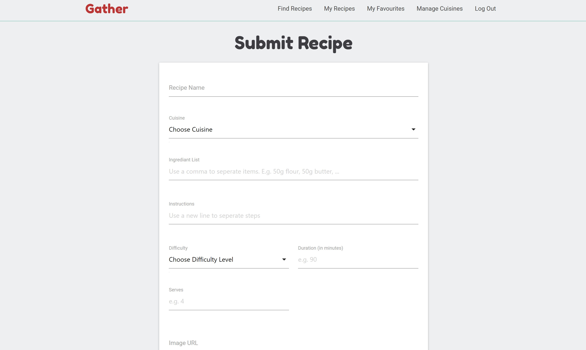</h2>

<h2 align="center">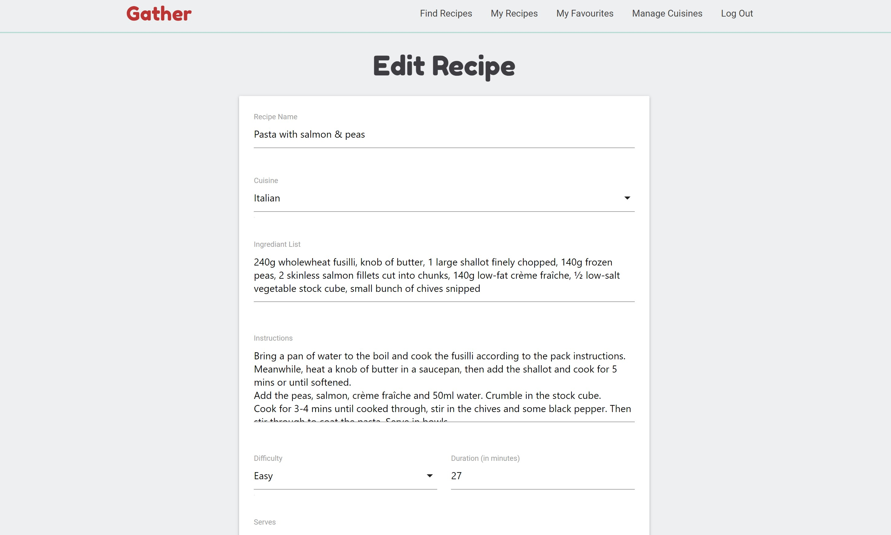</h2>

* Buttons and forms have been tested and proven to work.
* I've tested trying to access this page as a logged out user. I was not able to. I was redirected and flash message appeared informing me I did not have permission.
* I've tested trying to access this page as a different logged in user. I was not able to. I was redirected and flash message appeared informing me I did not have permission.
* I've tested editing the recipe ID in the URL. I was redirected back to the Find Recipes page.

## Delete Recipe

<h2 align="center">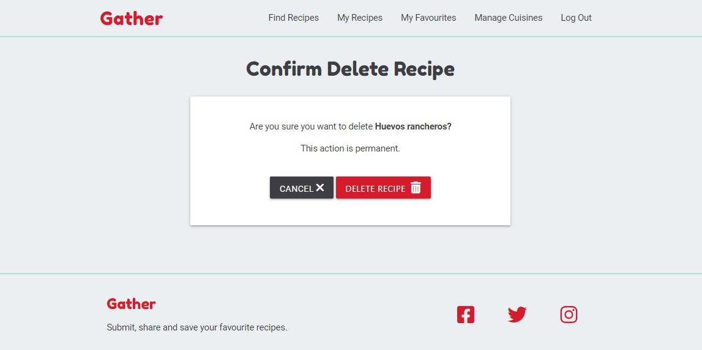</h2>

* Buttons and forms have been tested and proven to work.
* I've tested trying to access this page as a logged out user. I was not able to. I was redirected and flash message appeared informing me I did not have permission.
* I've tested trying to access this page as a different logged in user. I was not able to. I was redirected and flash message appeared informing me I did not have permission.
* I've tested editing the recipe ID in the URL. I was redirected back to the Find Recipes page.
* I've tested favouriting a recipe, and then deleting the recipe. The favourite was also deleted.

## Favourite Recipes

<h2 align="center"></h2>

* Buttons have been tested to work.
* The user is not able to favourite the same recipe mutliple time without unfavouriting it in between.
* I've tested trying to access this page as a logged out user. I was not able to. I was redirected and flash message appeared informing me I did not have permission.
* I've tested having no favourite recipes, and the correct messaging appears.

## Manage Cuisines 

<h2 align="center">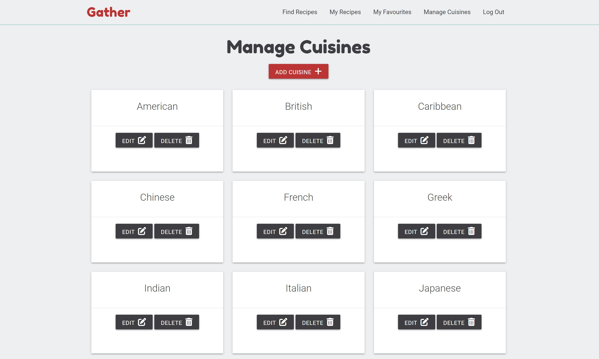</h2>

* Buttons have been tested to work.
* I've tested trying to access this page as a non-admin user. I was not able to. I was redirected and flash message appeared informing me I did not have permission.

## Add/ Edit Cuisines

<h2 align="center">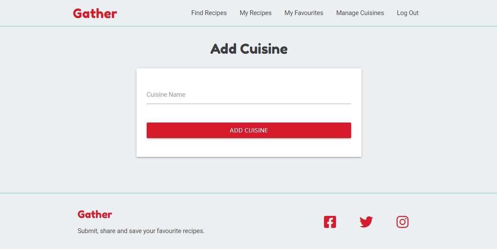</h2>

<h2 align="center">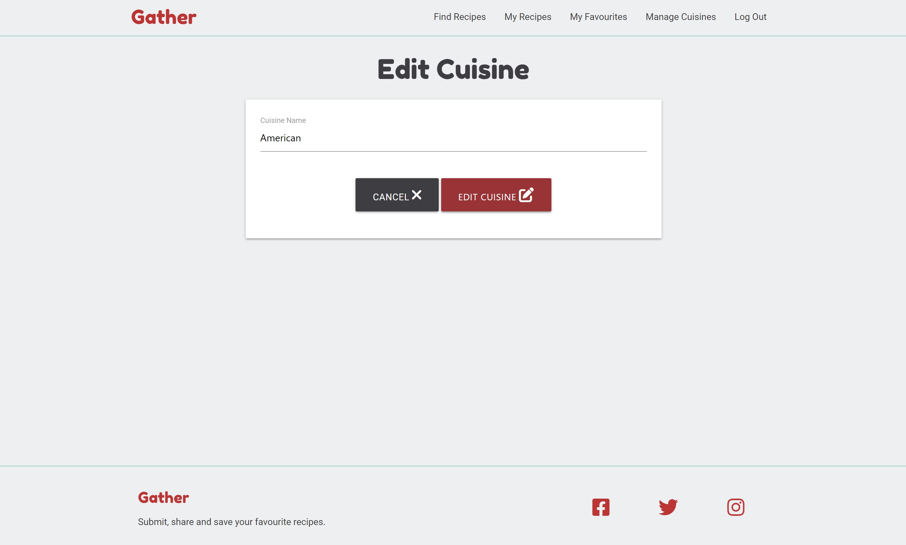</h2>

* Buttons have been tested to work.
* I've tested trying to access these pages as a non-admin user. I was not able to. I was redirected and flash message appeared informing me I did not have permission.
* I've tested editing the recipe ID in the URL. If I change it to a different number it redirects back to the Find Recipes page. However if I edit it to make an invalid URL then this throws an error (See Unresolved Bugs)
* I've tested trying to add the same cuisine name twice. I was not able to. I was redirected and flash message appeared informing me that name already exists.
* I've tested trying to edit a cuisine name to be the same as another cuisine name. I was redirected and flash message appeared informing me that there was an issue.

## Delete Cuisine

<h2 align="center">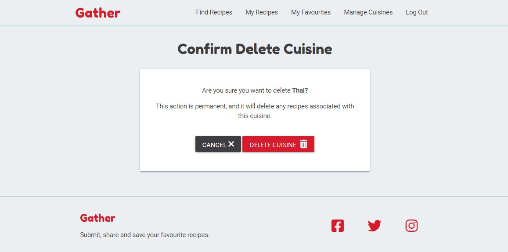</h2>

* Buttons have been tested to work.
* I've tested trying to access these pages as a non-admin user. I was not able to. I was redirected and flash message appeared informing me I did not have permission.
* I've tested editing the recipe ID in the URL. If I change it to a different number it redirects back to the Find Recipes page. However if I edit it to make an invalid URL then this throws an error (See Unresolved Bugs)
* I have tested out the cascade delete feature for recipes and for favoruites.

# Automated Testing

- Please note I only added Automated Testing at the end of the project. Not all features are tested. See more in my Future Features section.

## Python Tests

- I have set up a test to check the is_admin function. This functiona allows for multiple user names to be given admin permissions.

- I have set up a test to check that format_string_to_list function. This function formats user input into arrays for storing in MongoDB

- I have only tested functions that do not require a mock database.

## Javascript Tests

- I have created a test to check the turnArrayIntoString function. This function takes the array from MongoDB, and uses Javascript to present it as a string on the page.

# Peer Review

- In the final stages of the project, I submitted the site for Peer Review by fellow students and alumni at Code Institute via Slack.

- Feedback was positive on the appearance of the website. On a suggestion I updated the three-across section on the landing page to make it look better on iPad. It was also suggested I could increase the margin on the view recipe page on iPad. I took it into consideration but I decided not to do this.

- Peer testing demonstrated that I had overlooked testing some possible situations relating to favouriting and deleting recipes. These included:
    - If a user favourites a user's recipe, and then that user deletes the recipe
    - If a user favourites a recipe with a specific cuisine ID, and then that cuisine is deleted by admin.

- Peer review also pointed out an unresolved bug I had relating to the module.export method used by Jest JavaScript testing. I was able to find a resolution for this on Stack Overflow (see code credits).

# Bugs

- To Complete

## Resolved

- Heroku Postgres Database issue: I experienced an issue when I tried to change my Favourites model. At this point my database was already deplyed to Heroku. Looking on Slack and speaking to fellow CI students, it seemed likely that I could resolve my problem by resetting my database and creating my models again. I did this and it resolved the issue.

- Exsisting Cuisine Bug: Upon testing, I realised that users could still add duplicate cuisines. Upon reviewing the code, I realised that, because I had followed the username logic, I was only searching the database for lower case matches. I removed the .lower() method and this fixed the bug. This does mean however that admin users could add duplicate cuisines with different capitalisations. Further validation to the form could prevent.

<h2 align="center">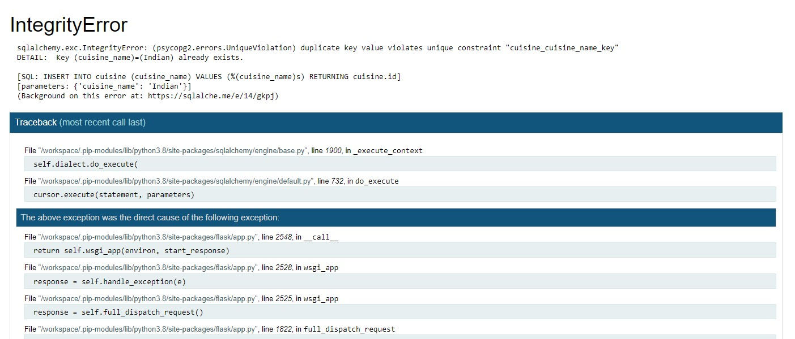</h2>

- Google Chrome Console error caused by Jest: The module.export method used by Jest JavaScript tesing was causing an error to appear in Google Chrome Developer Tools. I found a fix for this on Stack Overflow (see code credits).

<h2 align="center">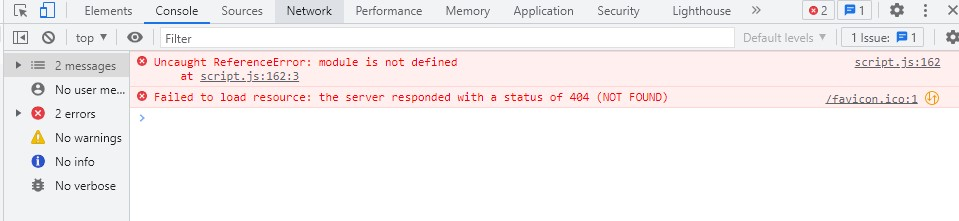</h2>

- Favourites not being removed upon deletion: Errors were being thrown if a user's favourite recipe was deleted, either by another user or my an admin deleting a cuisine, and cascade deleting the recipe. I added logic to the code to ensure favourites were being removed at the same time as recipes and cuisines were being deleted.

<h2 align="center">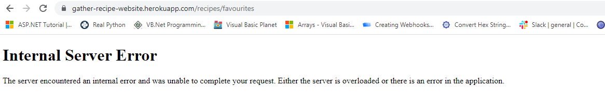</h2>

## Unresolved

- Admin Permissions on Nav Bar using an if/elif statement: Within Python, I am using the is_admin function to allow me to give mutliple usernames admin permissions. However I have not been able to reflect this logic in the Jinja templating I am using for the nav bar. As a solution, I have used an if/else statement. However this would need to be updated everytime a new user is granted admin permissions.

- 404 from Cuisine Functions: Upon testing my website, I realised that entering an invalid URL (such as entering a space) into some pages caused errors which were not handled by my Try/ Except clauses. I noticied that the pages being affected are generated by functions which relate to my Postgres data base. With these I am using a get_or_404 method. I assume this is causing this bug, but I need to do further testing to confirm.

<h2 align="center"></h2>

Back to [README.md](/README.md#testing)