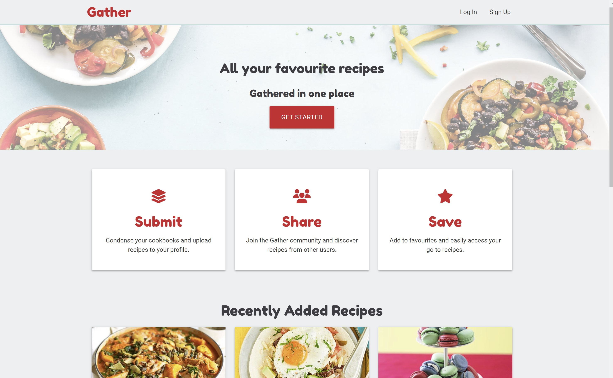
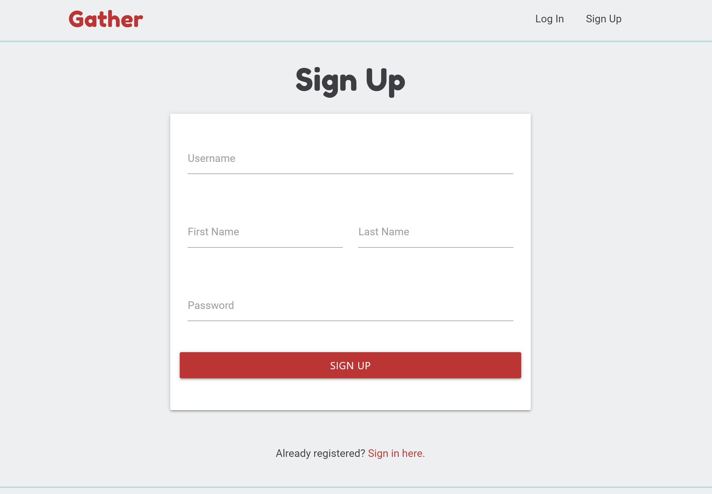
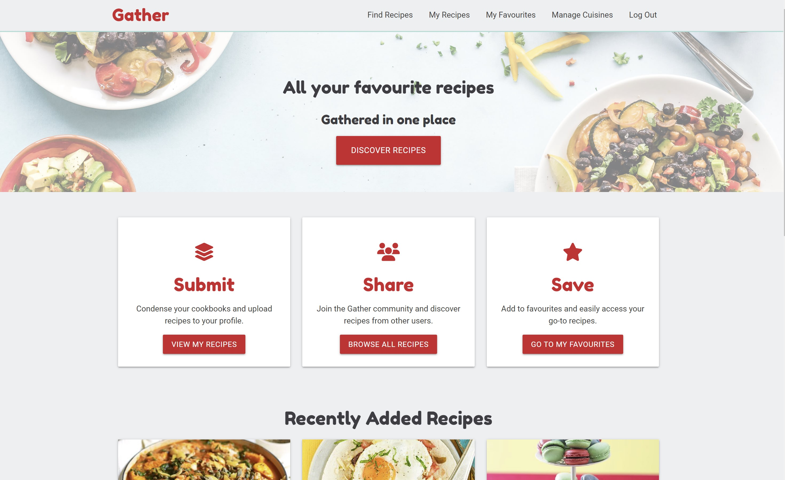
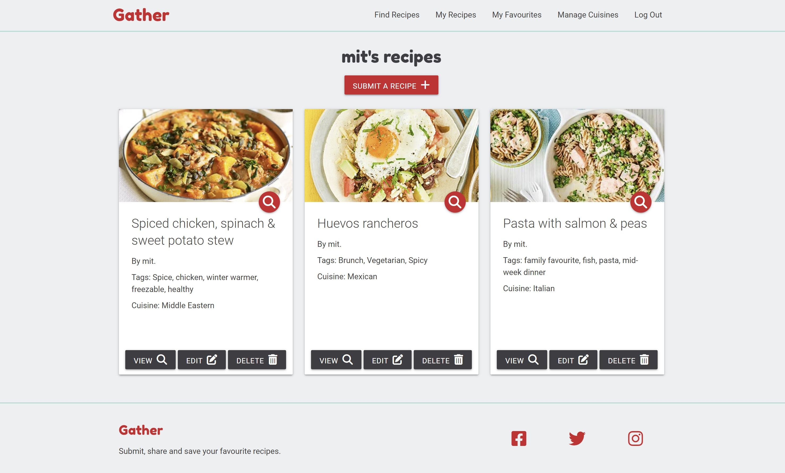
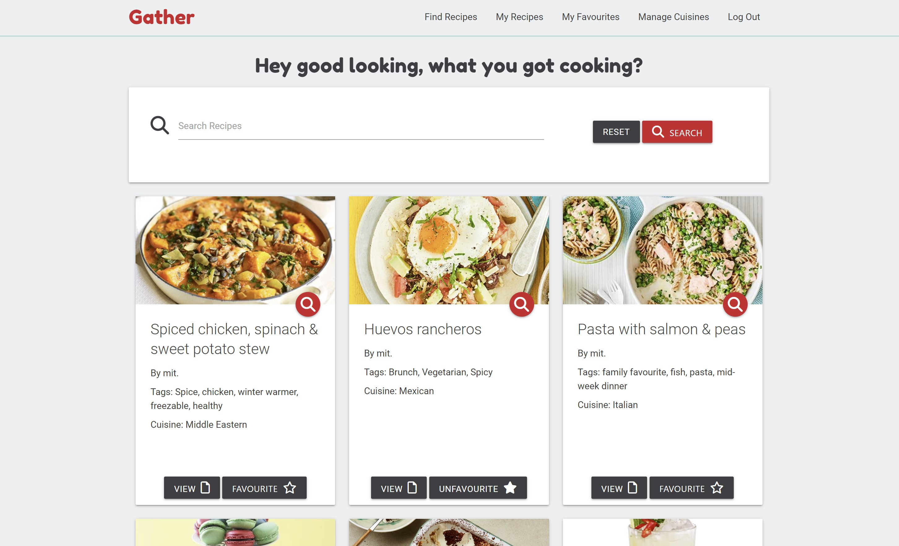
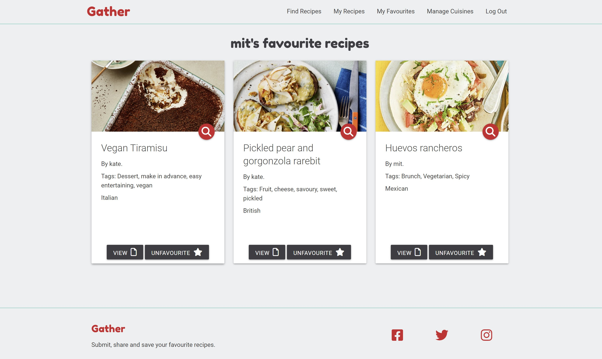
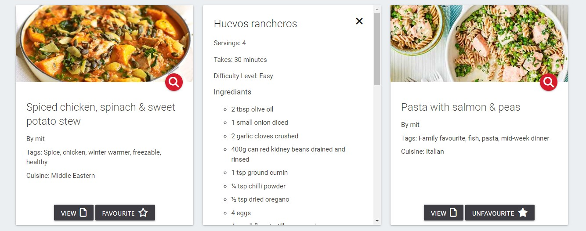
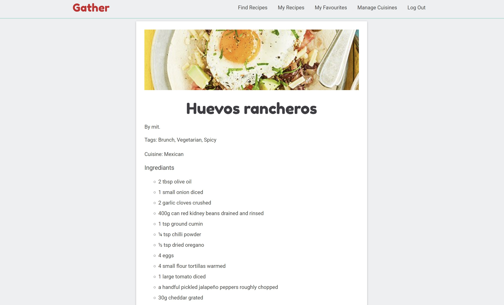

# Testing
# To Complete

The Gather recipe website has been tested using the following methods:
- [Code Validation](#code-validation)
    - [W3C HTML Validator](#w3c-html-validator) 
    - [W3C CSS Validator](#w3c-css-validator)
    - [JSHINT Javascript Code Quality Tool](#jshint-javascript-code-quality-tool)
    - [PEP8 Python Validator](#pep8-python-validator)
- [Lighthouse](#lighthouse)
- [Responsiveness](#responsiveness)
- [A11y Color Contrast Accessibility Checker](#a11y-color-contrast-accessibility-checker)
- [Browser Compatibility](#browser-compatibility)
- [Testing User Stories](#testing-user-stories)
    - [First Time User](#first-time-user)
    - [Returning User](#returning-user)
    - [Business Owner](#business-owner)
- [Manual Testing](#manual-testing)
- [Automated Testing](#automated-testing)
- [Peer Review](#peer-review)
- [Bugs](#bugs)
    - [Resolved](#resolved)
    - [Unresolved](#unresolved)

# Code Validation

## W3C HTML Validator

The Gather website passed all tests using the [W3C HTML](https://validator.w3.org/) Validator tool

## W3C CSS Validator

The Gather website passed all tests using the [W3C CSS](https://jigsaw.w3.org/css-validator/) Validator tool

## JSHINT Javascript Code Quality Tool

[JSHint](https://jshint.com/)

## PEP8 Python Validator

http://pep8online.com/

# Lighthouse

I used the Lighthouse reports in Google Developer Tools to examine the pages of the website for the following
- Performace
- Accessibility
- Best Practices 
- SEO

# A11y Color Contrast Accessibility Checker

# Browser Compatibility

The site was tested in Google Chrome, Microsoft Edge and Mozilla Firefox on desktop.

The site was tested in Google Chrome and Safari on mobile and tablet.

No issues arose during browser testing.

# Responsiveness

Responsivity tests were carried out using Google Chrome DevTools. Device screen sizes covered include:
- iPhone SE
- iPhone XR
- iPhone 12 Pro
- Pixel 5
- Samsung Galaxy S8+
- Samsung Galaxy S20 Ultra
- iPad Mini
- iPad Air
- Surface Pro 7
- Surface Duo
- Galaxy Fold
- Samsung Galaxy A51/71
- Nest Hub
- Nest Hub Max

I also personally tested the website on iPhone 11, iPad Pro 2nd Generation, Dell XPS 15 laptop and a Dell widescreen monitor.

# Testing User Stories

### First-time Users

- As a first-time user, I want the landing page of the website to explain the purpose of the website and allow me to preview the content.

    - The landing page of the website features an eye-catching jumbatron with an image and tag line which gives a feel and overview of the website. There is also a 'Three-across' section which explains the features in more detail.
    - There are some featured recipes so the user can preview content without logging in.
    - The website footer also features the website's name and a description of its purpose.

<h2 align="center"></h2>

* As a first-time user, I want to be able to register for an account.
     - There is a sign up page. These can be accessed from the nav bar and also from Call-to-action buttons on the landing page.
     - There is also a link on the log in page.

<h2 align="center"></h2>

* As a first-time user, I want the website to work on any device.

    - The website is responses and works on any device size.

### Returning Users

* As a returning user, I want to be able to log in to my account.
    - There is a log in page. This can accessed from the nav bar. There is also a link at the bottom of the sign up page.

<h2 align="center"></h2>

* As a returning user, I want to be able to create/ view/ edit/ delete my own recipes.
    - Logged in users have a My Recipes page where they can manage their recipes
    - Users can create recipes via the Submit Recipe button
    - Users can edit their own recipes via the Edit Recipe button
    - Users can delete their own recipes via the Delete Recipe button
    - Users can view their own recipes via the View Recipe button
    - Users can only edit and delete their own recipes.

<h2 align="center"></h2>

* As a returning user, I want to be able to view other user’s recipes.
    - Logged in users can access the Find Recipes page, which shows all user's recipes.
    - Users can quick view or view any other users' recipes.

<h2 align="center"></h2>

* As a returning user, I want to be able to favourite recipes and have a view where I can easily see all my favourite recipes in one place. I also want to be able to unfavourite recipes to remove them from this view.
    - Logged in users can use the Favourite Recipe feature.
    - If a user 'favourites' a recipe, it will appear in their My Favourites page.
    - If a user 'unfavourites' a recipe, it will be removed from their My Favourites page

<h2 align="center"></h2>

* As a returning user, I want recipes to include useful information such as a title, ingredient list, instructions broken down into steps, time to make, difficulty level, cuisine, serving size, tags, link to a URL and an image. 
    - These features are included in the Quick View and View Recipe views.
    - If no image URL is provided, then a default image is used.

* As a returning user, I want to be able to get a quick overview of a recipe, but also view that recipe on its own page.
    - The user can use the Quick-View feature to quickly see more about a recipe.
    - The user can choose to View the Recipe to get the recipe presently clearly on its own page.

<h2 align="center"></h2>
<h2 align="center"></h2>

* As a returning user, I want to be able to search for recipes, to make it quicker to find recipes with a certain word in their name, tags or ingredient list.
    - The user can use the search function on the Find Recipes page.

* As a returning user, I want to be able to access and use the website on any device.
    - The website is functional on any screen size.

### Buisness Owner

* As a business owner, I want only logged in users to be able to submit and favoruite recipes. I want user to only be able to edit and delete their own recipes, but not those of any other user.
    - There are permissions in place, so users must be logged in to access certain pages, and users can only edit and delete their own recipes.

* As a business owner, I want the adding, editing and deleting of cuisines to be limited to admin or those with permission. 
    - There are permissions in place, so users must be admins to access manage cuisine pages, and admins can only edit and delete cuisines.

* As a business owner, I want it to be as easy as possible for users to submit recipes, e.g. they can copy and paste an ingredients list in.
    - There are text-area inputs so that users can copy and paste recipes in.

* As a business owner, I want the website to function and look good on any device.
    - The website functions and looks good on any device size.

# Manual Testing

# Automated Testing

# Peer Review

# Bugs

## Resolved

## Unresolved

Back to [README.md](/README.md#testing)